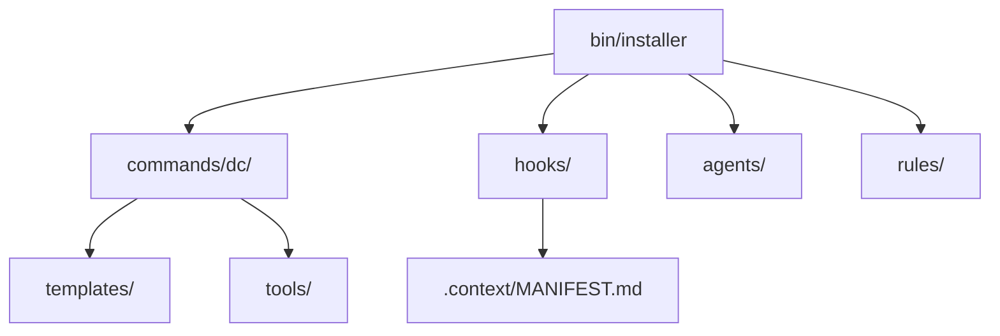

# Phase 24: Visual Enhancements - Research

**Researched:** 2026-03-18
**Domain:** Starlight MDX components (Tabs, Mermaid diagrams)
**Confidence:** HIGH

## Summary

This phase adds two visual enhancements to the existing Starlight documentation site: Mermaid diagrams on the architecture page and tabbed install variant blocks on the landing page and quickstart. Both are well-supported patterns in the Starlight ecosystem.

Starlight ships built-in `<Tabs>` and `<TabItem>` components that require zero configuration -- just import and use in MDX files. Mermaid support requires the `astro-mermaid` integration (v1.3.1), which renders fenced `mermaid` code blocks client-side with automatic dark/light theme switching. The integration must be placed before `starlight` in the integrations array.

**Primary recommendation:** Install `astro-mermaid` and `mermaid` as dependencies, add the integration to `astro.config.mjs` before Starlight, then use standard Mermaid fenced code blocks and Starlight Tabs components in the existing MDX files.

<user_constraints>
## User Constraints (from CONTEXT.md)

### Locked Decisions
- Two diagrams: (1) component relationship diagram showing module ownership and dependencies, (2) data flow diagram showing install -> init -> session -> edit lifecycle
- Use Starlight's built-in Mermaid support (plugin or expressive-code integration) -- no custom CSS
- Replace the existing text tree diagram with a Mermaid equivalent -- cleaner rendering
- Default Mermaid theme with Starlight's dark/light mode -- no custom styling
- Tabbed install blocks on landing page (index.mdx) and quickstart (quickstart.mdx)
- Tab labels: "Global (recommended)" and "Local"
- Use Starlight's built-in `<Tabs>` and `<TabItem>` components -- zero config, dark/light compatible
- Add a third "Uninstall" tab on the quickstart page only

### Claude's Discretion
- Exact Mermaid diagram syntax and node labels
- Whether to add Mermaid as an Astro integration or use fenced code blocks
- Tab content wording (adapt from existing install commands)
- Order of tabs (Global first as recommended)

### Deferred Ideas (OUT OF SCOPE)
None -- discussion stayed within phase scope.
</user_constraints>

<phase_requirements>
## Phase Requirements

| ID | Description | Research Support |
|----|-------------|-----------------|
| ENH-01 | Mermaid architecture diagrams on concepts/architecture pages | astro-mermaid integration renders fenced mermaid code blocks; two diagrams sourced from ARCHITECTURE.md module map and data flow |
| ENH-02 | Tabbed content blocks for global vs local install variants | Starlight built-in Tabs/TabItem components, zero config, syncKey for cross-page sync |
</phase_requirements>

## Standard Stack

### Core
| Library | Version | Purpose | Why Standard |
|---------|---------|---------|--------------|
| @astrojs/starlight | ^0.38.1 | Documentation framework | Already installed, provides Tabs/TabItem built-in |
| astro-mermaid | 1.3.1 | Mermaid diagram rendering | Community standard for Starlight Mermaid; client-side rendering, auto theme switching |
| mermaid | 11.13.0 | Diagram engine (peer dep) | Required by astro-mermaid |

### Supporting
| Library | Version | Purpose | When to Use |
|---------|---------|---------|-------------|
| (none) | - | - | Tabs are built-in to Starlight, no additional packages needed |

### Alternatives Considered
| Instead of | Could Use | Tradeoff |
|------------|-----------|----------|
| astro-mermaid | Raw mermaid script tag | astro-mermaid handles theme switching and conditional loading automatically |
| astro-mermaid | starlight-client-mermaid | Less maintained; astro-mermaid has broader adoption and recent updates |

**Installation:**
```bash
cd docs && npm install astro-mermaid mermaid
```

**Version verification:** astro-mermaid 1.3.1 (January 2026), mermaid 11.13.0 -- both verified via npm registry 2026-03-18.

## Architecture Patterns

### Configuration Change
The only config change is adding `mermaid()` to `astro.config.mjs` **before** `starlight()`:

```javascript
import { defineConfig } from 'astro/config';
import starlight from '@astrojs/starlight';
import mermaid from 'astro-mermaid';

export default defineConfig({
  site: 'https://senivel.github.io',
  base: '/domain-context-claude',
  integrations: [
    mermaid(),   // MUST come before starlight
    starlight({
      // ... existing config unchanged
    }),
  ],
});
```

### Pattern 1: Mermaid Fenced Code Blocks
**What:** Write diagrams as standard fenced code blocks with `mermaid` language identifier.
**When to use:** Any MDX or MD file in the docs site.
**Example:**
```markdown
```mermaid
graph TD
    A[commands/dc/] -->|uses| B[templates/]
    A -->|uses| C[tools/]
    D[hooks/] -->|reads| E[.context/MANIFEST.md]
`` `
```

The astro-mermaid integration automatically detects these blocks and renders them client-side. No imports needed in the MDX file.

### Pattern 2: Starlight Tabs Component
**What:** Built-in tabbed interface for showing variants side-by-side.
**When to use:** Showing global vs local install commands.
**Example:**
```jsx
import { Tabs, TabItem } from '@astrojs/starlight/components';

<Tabs syncKey="install">
  <TabItem label="Global (recommended)">
    ```bash
    npx domain-context-cc
    ```
  </TabItem>
  <TabItem label="Local">
    ```bash
    npx domain-context-cc --local
    ```
  </TabItem>
</Tabs>
```

The `syncKey="install"` ensures that if a user picks "Local" on one page, the same tab is pre-selected on other pages.

### Anti-Patterns to Avoid
- **Mermaid integration after Starlight:** Placing `mermaid()` after `starlight()` in the integrations array causes the remark plugin to not process code blocks correctly.
- **Custom Mermaid CSS:** The decision explicitly says "no custom CSS" -- rely on astro-mermaid's autoTheme for dark/light support.
- **Importing Tabs in non-MDX files:** Tabs/TabItem only work in `.mdx` files, not `.md`.

## Don't Hand-Roll

| Problem | Don't Build | Use Instead | Why |
|---------|-------------|-------------|-----|
| Mermaid rendering | Custom script injection | astro-mermaid integration | Handles theme switching, conditional loading, SSR compat |
| Tabbed content | Custom CSS/JS tabs | Starlight Tabs component | Built-in, accessible, syncs across pages |
| Dark/light diagram themes | CSS overrides | astro-mermaid autoTheme | Detects Starlight's theme attribute automatically |

**Key insight:** Both features are solved problems in the Starlight ecosystem. Zero custom code needed.

## Common Pitfalls

### Pitfall 1: Integration Order in astro.config.mjs
**What goes wrong:** Mermaid code blocks render as plain text instead of diagrams.
**Why it happens:** The mermaid remark plugin must process markdown before Starlight's pipeline.
**How to avoid:** Place `mermaid()` before `starlight()` in the integrations array.
**Warning signs:** Raw mermaid syntax visible on rendered page.

### Pitfall 2: Complex Mermaid Syntax in MDX
**What goes wrong:** MDX parser chokes on special characters in Mermaid syntax (angle brackets, curly braces).
**Why it happens:** MDX treats certain characters as JSX.
**How to avoid:** Use simple node labels. Avoid `<` and `>` in labels. Use square brackets `[text]` or round parentheses `(text)` for node shapes. If needed, wrap text in quotes within Mermaid syntax.
**Warning signs:** Build errors pointing to MDX parsing failures in the architecture page.

### Pitfall 3: Forgetting to Import Tabs
**What goes wrong:** `<Tabs>` renders as literal text or causes build error.
**Why it happens:** MDX requires explicit imports for components.
**How to avoid:** Add `import { Tabs, TabItem } from '@astrojs/starlight/components';` at top of each MDX file that uses tabs. The architecture page already imports other Starlight components, but index.mdx and quickstart.mdx need to add Tabs/TabItem to their imports.
**Warning signs:** Build errors or raw HTML tags in output.

### Pitfall 4: Tab Content Indentation
**What goes wrong:** Code blocks inside TabItem don't render correctly.
**Why it happens:** MDX is sensitive to indentation of nested content.
**How to avoid:** Keep code fences at the same indentation level as surrounding TabItem content. Don't over-indent.
**Warning signs:** Broken code block rendering inside tabs.

## Code Examples

### Component Relationship Diagram (ENH-01, Diagram 1)
Based on ARCHITECTURE.md module map:
```

```

### Data Flow Diagram (ENH-01, Diagram 2)
Based on ARCHITECTURE.md data flow:
```
```mermaid
graph LR
    A[npx domain-context-cc] --> B[bin/install.js]
    B --> C[Files copied to ~/.claude/]
    C --> D[Hooks registered]
    D --> E[/dc:init]
    E --> F[.context/ created]
    F --> G[Session start]
    G --> H[Freshness check]
    H --> I[Edit code]
    I --> J[Context reminder]
```
```

### Tabbed Install Block (ENH-02)
For index.mdx (two tabs):
```jsx
import { Tabs, TabItem } from '@astrojs/starlight/components';

<Tabs syncKey="install">
  <TabItem label="Global (recommended)">
    ```bash
    npx domain-context-cc
    ```
  </TabItem>
  <TabItem label="Local">
    ```bash
    npx domain-context-cc --local
    ```
  </TabItem>
</Tabs>
```

For quickstart.mdx (three tabs, including Uninstall):
```jsx
import { Tabs, TabItem } from '@astrojs/starlight/components';

<Tabs syncKey="install">
  <TabItem label="Global (recommended)">
    ```bash
    npx domain-context-cc
    ```
  </TabItem>
  <TabItem label="Local">
    ```bash
    npx domain-context-cc --local
    ```
  </TabItem>
  <TabItem label="Uninstall">
    ```bash
    npx domain-context-cc --uninstall
    ```
  </TabItem>
</Tabs>
```

## State of the Art

| Old Approach | Current Approach | When Changed | Impact |
|--------------|------------------|--------------|--------|
| Server-side Mermaid rendering | Client-side via astro-mermaid | 2025 | No build-time Puppeteer/Playwright dependency |
| Manual dark/light theme | autoTheme in astro-mermaid | v1.3+ | Automatic theme detection from Starlight |
| Custom tab implementations | Built-in Starlight Tabs | Starlight 0.28+ | Zero-config, accessible, syncable |

## Open Questions

1. **MDX special character handling in Mermaid**
   - What we know: MDX can interfere with Mermaid syntax containing JSX-like characters
   - What's unclear: Whether the specific diagrams needed here will trigger issues
   - Recommendation: Use simple bracket notation; test build after adding diagrams

## Validation Architecture

### Test Framework
| Property | Value |
|----------|-------|
| Framework | Astro build (static site) |
| Config file | docs/astro.config.mjs |
| Quick run command | `cd docs && npm run build` |
| Full suite command | `cd docs && npm run build` |

### Phase Requirements -> Test Map
| Req ID | Behavior | Test Type | Automated Command | File Exists? |
|--------|----------|-----------|-------------------|-------------|
| ENH-01 | Mermaid diagrams render on architecture page | smoke (build succeeds) | `cd docs && npm run build` | N/A (build check) |
| ENH-02 | Tabbed install blocks render on index and quickstart | smoke (build succeeds) | `cd docs && npm run build` | N/A (build check) |

### Sampling Rate
- **Per task commit:** `cd docs && npm run build`
- **Per wave merge:** `cd docs && npm run build`
- **Phase gate:** Build succeeds without errors

### Wave 0 Gaps
- [ ] `astro-mermaid` and `mermaid` packages must be installed before any diagram work

## Sources

### Primary (HIGH confidence)
- [Starlight Tabs documentation](https://starlight.astro.build/components/tabs/) -- import syntax, props, syncKey feature
- [astro-mermaid GitHub](https://github.com/joesaby/astro-mermaid) -- installation, Starlight integration order, configuration
- [astro-mermaid demo](https://starlight-mermaid-demo.netlify.app/) -- confirmed Starlight compatibility

### Secondary (MEDIUM confidence)
- [Starlight Mermaid discussion #1259](https://github.com/withastro/starlight/discussions/1259) -- community consensus on integration approach
- npm registry -- version verification (astro-mermaid 1.3.1, mermaid 11.13.0)

## Metadata

**Confidence breakdown:**
- Standard stack: HIGH -- verified versions via npm, official docs confirm usage patterns
- Architecture: HIGH -- single config change (integration order) is well-documented
- Pitfalls: HIGH -- integration order issue is widely documented; MDX parsing is a known concern

**Research date:** 2026-03-18
**Valid until:** 2026-04-18 (stable ecosystem, unlikely to change)
